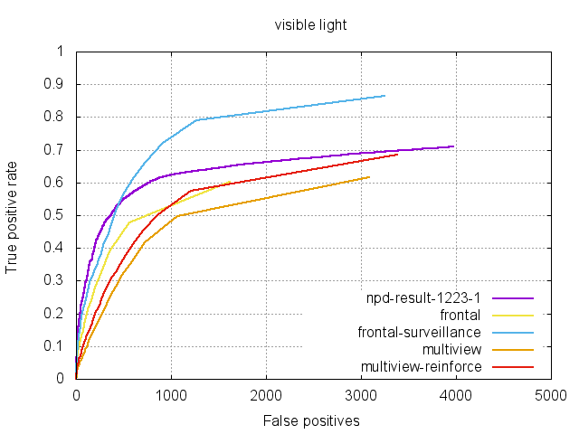
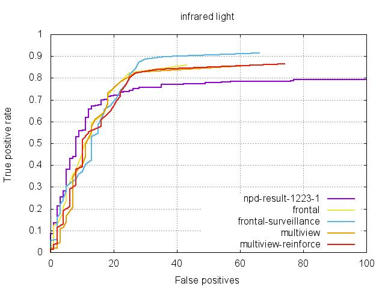

# exfastfacedetection

A very fast library for face detection and face landmark detection in images. The face detection speed can reach 1500FPS on GTX 1080Ti.

## Comparison on x86-64

- CPU: Intel i7-6700k
- GPU: GTX TitanX(Maxwell) * 2
- min_window_size: 48
- npd model: 1223-1
- multi threads: 8
- threads per GPU: 4
- single thread execution policy: as fast as possible
- multi thread execution policy: no thread blocking

### 640*480 resolution(single-thread)
| Method             |Time         | FPS         | CPU Usage(Aveage) |
|--------------------|-------------|-------------|-----------|
|OpenCV              | --          | --          | --  |
|frontal             | 3.41ms      | 414.9       | 17% |
|frontal-surveillance| 4.37ms      | 269.7       | 14% |
|multiview           | 7.81ms      | 172.1       | 17% |
|multiview_reinforce | 11.15ms     | 109.3       | 16% |
|cunpd				 | 6.72ms      | 184.8       | 13% |

### 1920*1080 resolution(single-thread)
| Method             |Time         | FPS         | CPU Usage(Aveage) |
|--------------------|-------------|-------------|-----------|
|OpenCV              | --          | --          | --  |
|frontal             | 20.65ms     | 49.1   	 | 17% |
|frontal-surveillance| 23.11ms     | 43.5        | 16% |
|multiview           | 37.92ms     | 27.0        | 17% |
|multiview_reinforce | 55.43ms     | 18.0        | 16% |
|cunpd				 | 15.24ms     | 65.8        | 8%  |

### 640*480 resolution(multi-thread)

| Method             |Time         | FPS         | CPU Usage(Aveage) |
|--------------------|-------------|-------------|-----------|
|OpenCV              | --          | --          | --   |
|frontal             | 7.43ms      | 134.6       | 100% |
|frontal-surveillance| 9.57ms      | 104.5       | 100% |
|multiview           | 14.08ms     | 71.0        | 100% |
|multiview_reinforce | 21.47ms     | 46.6        | 100% |
|cunpd				 | 25.06ms     | 39.9        | 23%  |

### 1920*1080 resolution(multi-thread)
| Method             |Time         | FPS         | CPU Usage(Aveage) |
|--------------------|-------------|-------------|-----------|
|OpenCV              | --          | --          | --   |
|frontal             | 36.47ms     | 27.8   	 | 100% |
|frontal-surveillance| 43.99ms     | 22.7      	 | 100% |
|multiview           | 73.64ms     | 13.7        | 100% |
|multiview_reinforce | 104.52ms    | 9.6       	 | 100% |
|cunpd				 | 96.13ms     | 10.4        | 20%  |

## Comparison on ARM

## Accuracy Preformance
### visible lighting condition

### infrared lighting condition
